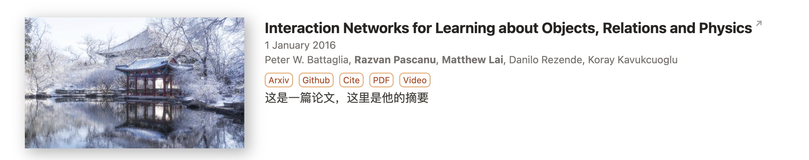
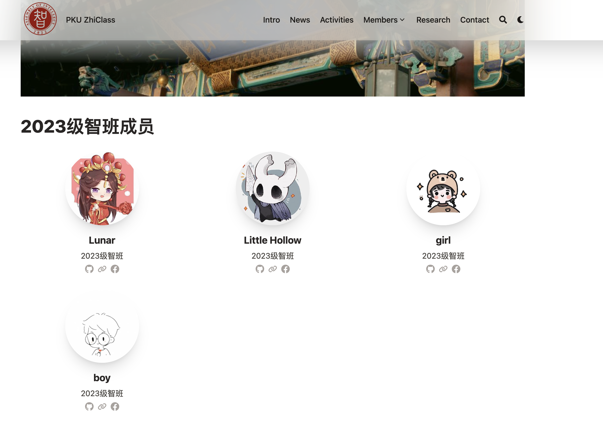
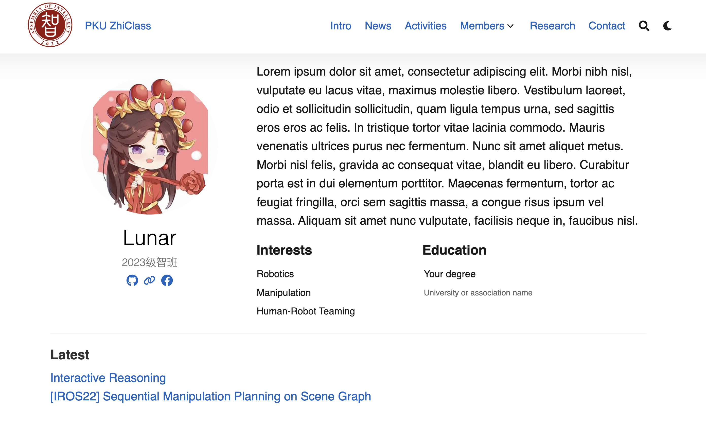

# Usage 

### clone仓库到本地

```shell
git clone --recurse-submodules git@github.com:PKUZhiClass/Zhi-Class.git
```

如果你忘记加`--recurse-submodules`参数，可以进入 `Zhi-Class` 根目录并运行 

```shell 
git submodule update --init --recursive
```

这样blowfish模块会被下载到本地。

### 与别人的工作合并

如果你和某个同学同时从某个节点开始修改，如果可以合并代码，请使用

```shell
git pull --no-rebase origin develop  
```

# Update Log
- 8月9日
    - research模块和activity模块基本搭建完成（可能存在一些小bug但是不影响使用）。我在```./content/research/example```、```./content/activities/example```以及```./content/activities/example_2```中放了三个例子。展示了如何使用这两个模块。**请注意，research模块的配置参数经过特殊设计，请严格按照例子中的格式进行配置。**
    - 我按照我的需求调整了config中的一些参数，确保网页在```layout = "background"```模式以及```showCard=false```的情况下可以正常运行（当然其他参数可能也改了，我只写出我记得比较重要的两个）。
    - homepage的显示方式进行了调整，大家可以运行查看，主要改了```_index.md```的渲染方式，把标题居左并调整了宽度，我觉得这样比较美观。同时homepage的文章卡片是使用[shortcode](https://blowfish.page/zh-cn/docs/shortcodes/)的方式实现的，可以参考```_index.md```中的写法。
        - 请参考```./layouts\partials\article-link\simple.html```
    - 现在的research文章实现了以下的功能
        - 点标题跳arxiv
        - 点标签（arxiv, github...）跳相应网站
        - 点Cite标签跳转cite.bib
        - 作者名字加粗
        - 显示摘要
        - 请参考```./layouts\partials\article-meta\basic.html```以及```./layouts\partials\home\background.html```
    - activity的文章基本上是用blowfish的内置功能实现的，该有的都有了
    - 我按照[这篇文章](https://blowfish.page/zh-cn/docs/advanced-customisation/)的方法修改了源码（**请不要直接更改源码！！**），更改的文件放在：
        - ```./layouts\partials\article-link\simple.html```
        - ```./layouts\partials\article-meta\basic.html```
        - ```./layouts\partials\home\background.html```
    - 有任何问题请联系林宇辰
- 8月10日
    - 增加 modal 弹窗功能，js脚本位于 ```./layouts\partials\article-meta\basic.html```中，目前暂时用于文章CiteTag的bibtex的显示、下载，如有其他地方需要可复用。
    
- 8月12日
    
    **整合了之前的代码，大致完成了members list页面、点进去之后每个人的具体页面的框架搭建，同时进行了一些全局params的修改**。具体如下：
    
    1. 将`params.toml`中[list]下的 `cardView` 从 false 改为 true. 
       - 如果是false，则在渲染list（比如members/2023 页面上每个人的缩略展示框）时不会调用 `partials/article-link/card.html`，而是采用如下的默认样式：
    
        

       - ​而原生的cardView呈现论文不美观。

            由于呈现members需要定制化cardView，故不得不启用cardView = true. 因此对于**Research板块**的**替代方法**是在 `./Research/_index.md` 的front matter中添加 `cardView: false`。即采用override机制。


        > [!WARNING]
        >
        > 请注意front matter的两种写法：一种是以"---"包围，则应写成 `cardView: false`；一种是以"+++"包围，则应写成 `cardView = false`. 


    2. 在members和具体的2021, 2022, 2023的页面，为了在这些页面不显示日期（blowfish会默认将articles按照date排序和分类，如果 `index.md` 中没有date属性，默认年份为 0001 ），在每个文件夹下的 `_index.md` 中添加 `groupByYear: false` 属性。


    3. 将members的展示形式做成了圆形icon的card。效果如图：

        

        （~~这4个头像成分复杂🤣~~） 可以看到是1行3个的grid。这部分代码是修改了 `layouts/partials/article-link/card.html`, 在每个member具体的markdown文件中添加了 `isMember: true` 的属性，从而在partials的代码中特判。同时在所有代码采用的main.css中添加了 `class = thumbnail_circle` 的样式（就是这个圆圆的icon）。

        > [!TIP]
        >
        > 实际上并没有直接修改 `main.css` ，而是利用override机制添加了 `asset/css/custom.css` 文件并单独补充 `thumbnail_circle` 类。


    4. 每个人的具体页面的css设计。这部分完全照抄[Hugo Academic CV Theme (academic-demo.netlify.app)](https://academic-demo.netlify.app/)和[Yida Niu | PKU CoRe Lab](https://pku.ai/author/yida-niu/)。通过将网页的html借助GPT改写为template，并复制相应的css文件（放在了`asset/css/wowchemy.css`）。渲染article的除header、footer以外部分的代码是 `layouts/_default/single.html`，通过 `isMember`属性特判，将个人简历的代码单独渲染。

        具体而言，单独写了一个 `layouts/partial/members/basic.html` 文件作为template，并导入到修改过的 `single.html` 中。

        为了在最后展示大家的论文，单独在原来模板的末尾添加了 **latest** 板块，论文也将通过 front matter 的方式导入 title 和 url.

        效果如下：

        

        > [!NOTE]
        >
        > 有个bug是导入css的时候会让header和footer的字体变成**蓝色**（如上图），目前不清楚如何解决。

        之后收材料的时候，每个人的markdown文件按如下样例写：

        ```markdown
        ---
        name: "Lunar"
        isMember: true
        image: "./featured.jpeg" # 照片命名成featured.jpeg
        memberType: "2023级智班"
        bio: "Lorem ipsum dolor sit amet ..."

        links: [
            { github: "https://github.com/someone"},
            { envelope: "someone@stu.pku.edu.cn/"},
            { link: "url-to-one's-home-page" } # 个人主页
        ]

        interests:
            - Robotics
            - Manipulation 
            - Human-Robot Teaming
        education:
        - degree: "Your degree"
            institution: "University or association name"

        publications:
        - title: "Interactive Reasoning"
            url: "https://link-to-some-webpage.com"
        - title: "[IROS22] Sequential Manipulation Planning on Scene Graph"
            url: "https://link-to-some-webpage.com"
        ---
        ```

        从这个文件可以看出，目前**没有**用taxonomy来标定authors和所作文章。


        有问题随时联系于旻扬、赵瑞捷。

        修改源码的方式仍然沿用[这篇文章](https://blowfish.page/zh-cn/docs/advanced-customisation/)，后续修改的同学请注意，你想要修改的文件是否之前已被修改过。


- 8月13日
    - UI与视觉效果修改
    - `layouts/partials/home/background.html` ： homepage增加了 carousel画廊功能，支持图片左右切换、显示文字描述，主要用于展示重大正式活动。（目前该模块中图片与描述均在html中写死，暂未提供从hugo本地文件直接生成的功能）由于与全局模板文件冲突，该横向画廊只能采取先生成后手动修改的方式，提供了脚本`changeindexhtml.py`，每次网页生成后需运行一次即可（如有需要可添加守护进程，监测文件系统修改自动运行）。 homepage全局禁用了图片缩放（不影响其他页面）。
    - `layouts/partials/home/background.html` ：原先标题挪到左下方，右侧添加introduction板块。
    - `params.toml`中的全局颜色主题从 `fire` 改为 `blowfish`
    - 默认全局背景改为`assets/img/background.svg`，提供动态图形背景以及logo与slogan，在未设置特殊背景的全局文章/list页面可见。
- 8月31日
    - members删除示例文章（解决两个2023），设置members页面一页显示人数（30）
- 9月1日
  - ~~activities增加articles数量。（ymy）~~
- 9月2日
  - 为了控制每个页面(list)最多显示的articles的数量，略微修改了`layouts/_default/list.html`的逻辑。在 `_index.md` 中如果有 `pageSize` 参数，会优先以该参数作为显示的最大文章数量。如果没有，会再提取 `hugo.toml` 中的 `paginate` 参数。
  **这一块还有bug，有些情况下访问 `.Site.Params.paginate` 会失败，原因目前未知**。为安全起见，在 `list.html` 中指定了 `pageSize` 的default值为 $30$,可供修改；同时对 `members` 文件夹中的每个年份的`_index.md`，指定 `pageSize = 40`，以保证所有人在同一个页面中。

- 9月2日
  - 由于多数浏览器ban了svg中的外链下载，将`全新硬笔行书简`、`华文行楷`两种字体中slogan使用到的子集以base64方式嵌入背景svg中。使用[ttf转base64](https://transfonter.org/) 与 [字体子集裁剪](https://fontsmaller.github.io/) 插件完成
  - 修改`background.html`中`carousel-container`的高度，改为撑满全屏
  - 在`/static`下加入`favicon`系列智班logo，更改网站图标
  
- 9月4日
  - 更新网站首页carousel表现形式，消除在网站长宽比过小（如手机）产生的显示bug
  - 更新homepage/intro的双语版本
  - > [!TIP]
    >
    > 由于暂时没找到什么好办法在`index.html`里渲染markdown文件，故还是用写死在html里实现。在 `config\_default\languages.en.toml` 和 `config\_default\languages.zh-CN.toml` 中增加了 languages_en 参数，并在html中使用if判断来解决双语切换的问题。 如果carousel中也要使用双语切换，可采用相同办法实现

    如有问题联系沈睿弘

- 9月4日
  - 修改css文件，使得member主页导航栏字体风格一致，修改主页字体

- 9月5日
  - 初步完成 join us 部分的框架。页面上方的内容通过 `joinUs/_index.md` 编辑。下方设定了3个类别（Type）：blogs, speakers, sponsors。为每个类别单独设一个文件夹，blogs的内容和一般的articles无异，speakers/sponsors的cardView和members一样。通过单独定制joinUs界面的`list.html`（方法和定制members中每个人的页面一样，主要代码位于`layouts/partials/joinUs/basic.html`，这段代码将引入原本的`list.html`），网页将依次渲染3个type的card。
  **TODO：cards呈现的顺序按照时间或其他方式排序。**
  
  - **请注意**，修改和添加新的样例时请在相应 `index.md` 的front matter 部分添加 `type: blog/speaker/sponsor`。参考示例。

    有问题随时联系于旻扬。

- 9月5日
  - 暂时隐藏了news和join us部分，方法是在`menus.en.toml`中注释掉两者。
  - 把research部分的示例论文移入`static/research-eg`。

- 9月6日
  - 增加主页intro的reactive deisgn，使用`@media`实现，修改下文页边距

- 9月7日
  - 完成了research和activities的中文内容复制，方式是直接添加 `index.zh-cn.md` 文件。实验发现图片不需要复制和修改文件名。
  具体并非手动复制，而是使用了 `static/scripts/copyRecursiveImage.py` 和 `static/scripts/copyRecursiveIndex.py` 两个脚本。
  - 解决了homepage中文版不显示recent和selected research文章的问题，在中文版 `index.zh-cn.md` 中需要将链接的**文件夹名称**前添加 `/zh-cn`，否则hugo仍然找的是英文版 `index.md` 。
  
# TODO

- 写一个从bib到research index.md的python脚本

